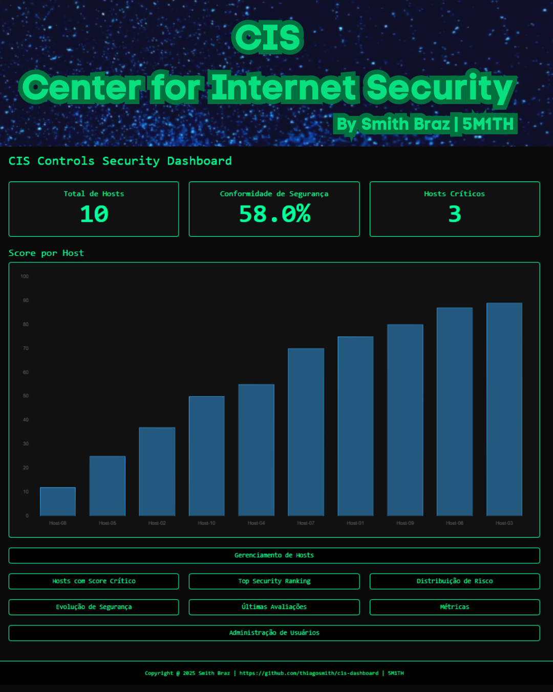
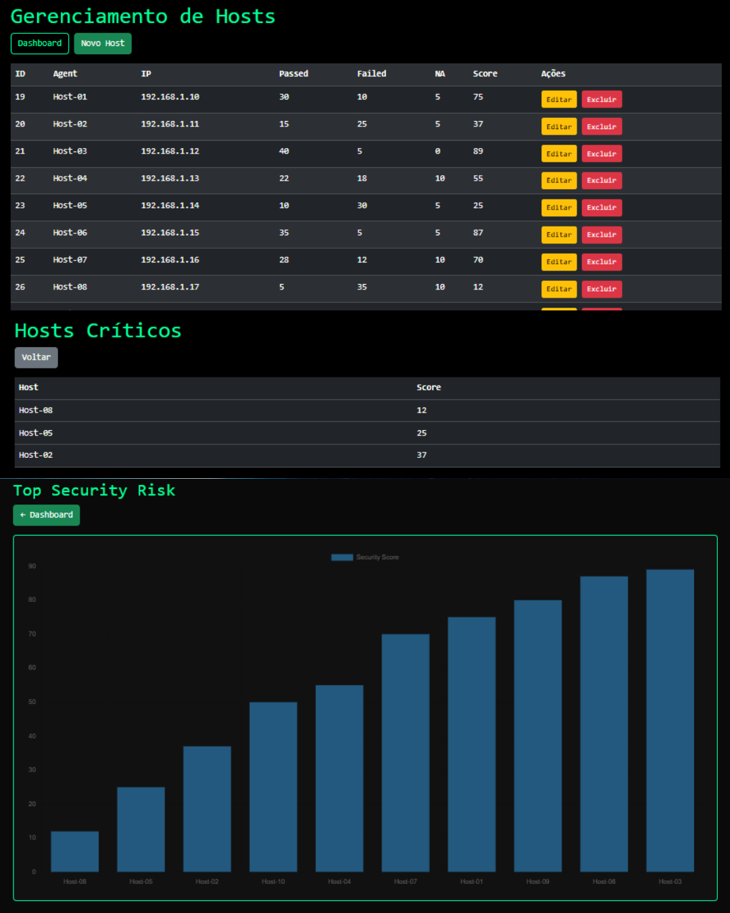
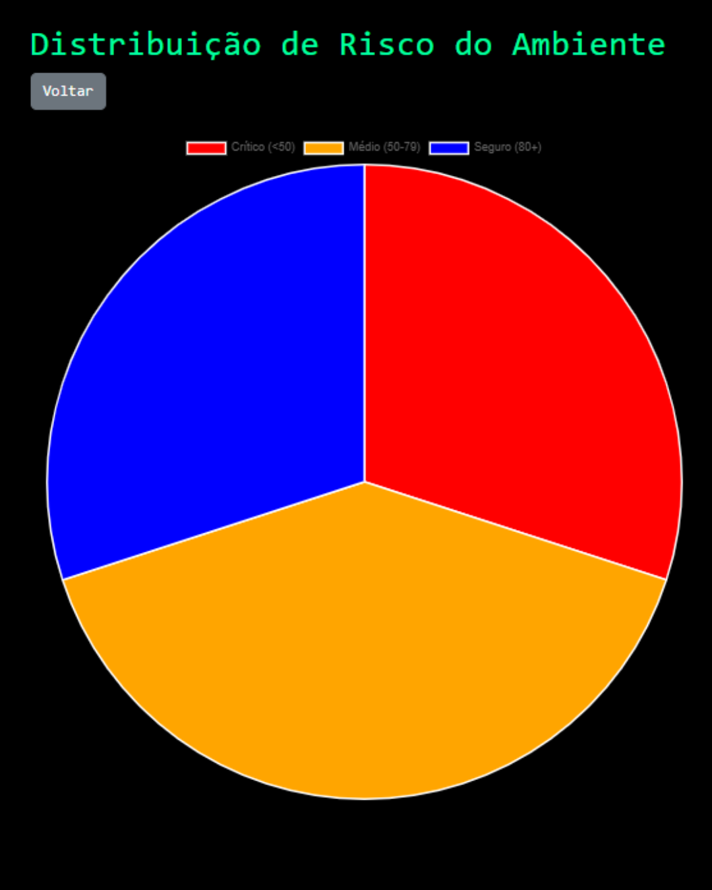
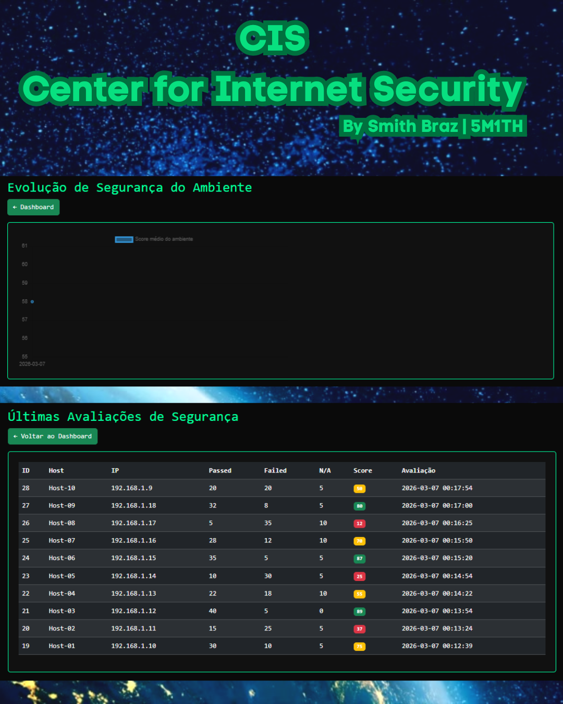
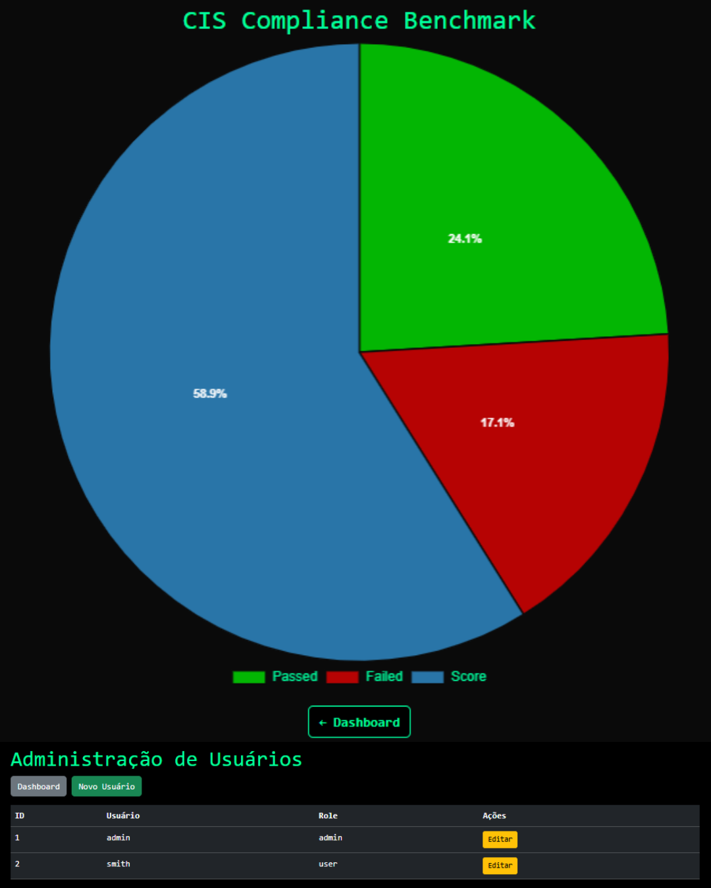

# CIS Controls Security Dashboard
O CIS (Center for Internet Security) é uma organização sem fins lucrativos que desenvolve os CIS Controls, um conjunto de práticas de segurança cibernética reconhecido mundialmente. Esses controles oferecem um guia estruturado e priorizado para reduzir riscos digitais e fortalecer a postura de segurança das empresas.

https://www.cisecurity.org/cis-benchmarks

Acompanhar esses controles em dashboards é fundamental porque eles transformam dados técnicos em informação visual clara e acionável. Isso ajuda tanto na gestão operacional quanto na tomada de decisão estratégica.

Pensando nisso desenvolvi um sistema web que roda em PHP para receber e corelacionar as informação de forma bem simples, mas eficiente e com o objetivo de diminuir a carga de trabalho e automatizar processos.

"Dashboards são como o painel de um carro — você não precisa abrir o motor para saber se há problema, basta olhar os indicadores. Eles tornam a segurança mais visual, rápida e estratégica.

## Dashboard de dados CIS Benchmarks
Objetivo é receber os dados de avaliação de segurança CIS e concentrar em um sistema capaz de acompanhar a evolução do ambiente por meio de dados tratados e dashboards visuais.




## Testado em ambiente Linux 
- Debian 13;
- Apache 2.4.66;
- PHP 8.4.16; e
- MariaDB 11.8.3.

## Credenciais:
```
Banco de dados:
Name-DB: cis_dashboard
User-DB: cis_user
Pass-DB: SenhaForte123!

Painel Administrativo:
User: admin
Pass: admin123
Role: admin

User: smith
Pass: smith
Role: user
```

## Instalação na unha:
- Instale o Linux;
- Clone o repositório;
- Instale o PHP;
- Instale o MySQL;
- Crie a base de dados;
- Crie o usuário e defina sua senha;
- Importe as tabelas para a base de dados a partir do arquivo `cis_dashboard.sql`
```
Atualização do Linux:
# apt update
# apt upgrade -y

Clonagem do repositório:
# cd /var/www/html
# apt install git -y
# git clone https://github.com/thiagosmith/cis-dashboard.git

Instalação do Apache2:
# apt install apache2 -y

Instalação do PHP:
# apt install php libapache2-mod-php php-mysql php-cli php-curl php-gd php-mbstring php-xml php-zip -y

Instalação do MariaDB (MySQL):
# apt install mariadb-server -y

Provisonamento do banco de dados:
# mysql -u root
MariaDB [(none)]> CREATE DATABASE cis_dashboard;
MariaDB [(none)]> CREATE USER 'cis_user'@'localhost' IDENTIFIED BY 'SenhaForte123!';
MariaDB [(none)]> GRANT ALL PRIVILEGES ON cis_dashboard.* TO 'cis_user'@'localhost';
MariaDB [(none)]> FLUSH PRIVILEGES;
MariaDB [(none)]> EXIT
# cd cis-dashboard
# mysql -u cis_user -pSenhaForte123! cis_dashboard < cis_dashboard.sql

Reinicialização do Apache2:
# systemctl restart apache2
```

## Instalação via docker:

```
# wget https://raw.githubusercontent.com/thiagosmith/cis-dashboard/refs/heads/main/docker-compose.yml
# apt install docker.io -y
# apt install docker-compose -y
# systemctl start docker
# docker-compose up
```
## Acesso: 
http://localhost:8080

## CIS Controls Security Dashboard


## Gerenciamento de Hosts / Hosts Críticos / Top Security Risk



## Distribuição de Risco do Ambiente



## Evolução da Segurança do Ambiente / Últimas Avaliações de Segurança



## CIS Compliance Benchmark




Sistema desenvolvido por para uso inerno e não comercial. Fique a vontade para utilizar, aprimorar, distribuir e cobrar por ele.
